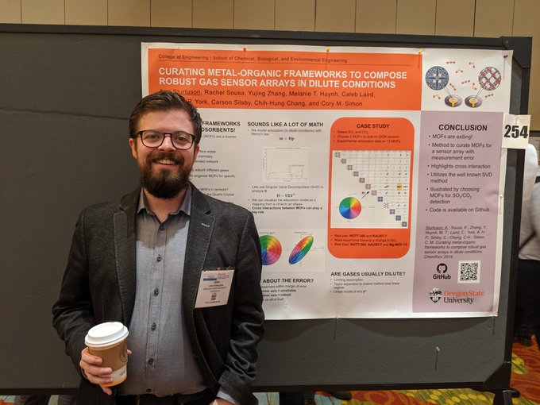
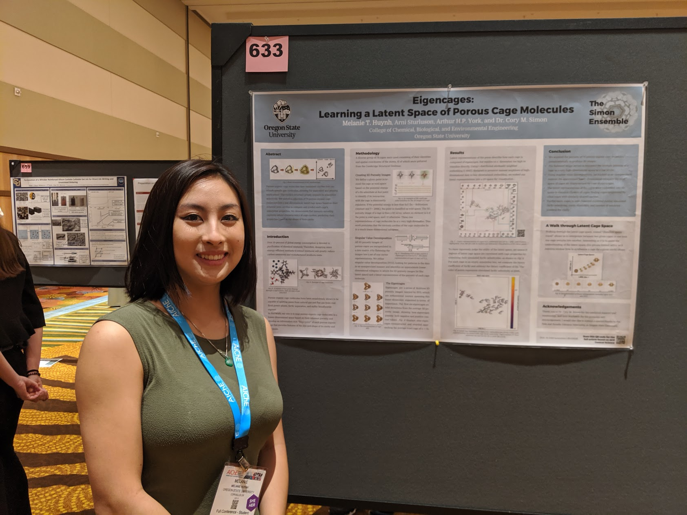

> I get the news I need on the weather report. - Simon (a different one) & Garfunkel

This page is dedicated to bragging about the accomplishments of students in our research ensemble!

# Arni, Melanie present at the national AIChE conference in Orlando

> pics or it didn't happen -unknown

# Melanie wins AIChE award

Melanie was awarded the Donald F. Othmer Sophomore Academic Excellence Award from the American Institute of Chemical Engineers (AIChE). See [here](https://www.aiche.org/community/awards/donald-f-othmer-sophomore-academic-excellence-award).

# an article about Rachel in iMPACT

A very nice article about Rachel in [iMPACT](http://impact.oregonstate.edu/2019/10/using-mathematical-biology-to-explore-everything-from-ecological-phenomenon-to-cancer-cells/).
