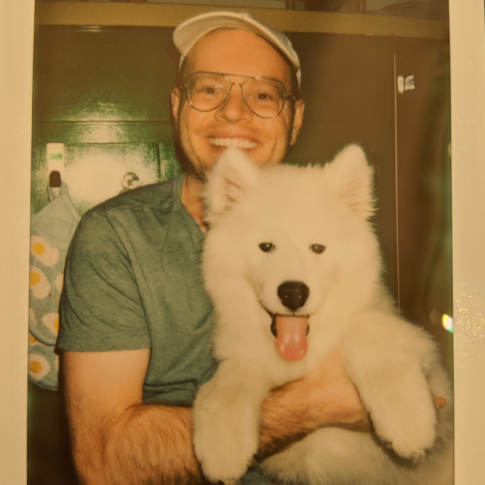

  School of Chemical, Biological, and Environmental Engineering 

<figure>
    

    
    

</figure>

# the assistant professor

**Cory Simon** hails from a small town in Ohio. He earned his B.S. in Chemical Engineering from the University of Akron. He then studied mathematics at the University of British Columbia in Vancouver, Canada for two years. In 2016, he earned his Ph.D. in Chemical Engineering from the University of California, Berkeley.

He conducted scientific research at Virginia Tech, Okinawa Institute of Science and Technology, Lawrence Berkeley National Laboratory, École Polytechnique Fédérale de Lausanne, and Altius Institute for Biomedical Sciences and interned in industry at Bridgestone Research (chemical engineering) and Stitch Fix (data science).

Since 2017, Cory is an assistant professor at Oregon State University in the School of Chemical, Biological, and Environmental Engineering. He lives with girlfriend, Christina, and his dog, Oslo. Cory digs hiking/backpacking in scenic places (photos on <a href="https://ello.co/cokes">Ello</a>), snowboarding, and wine.

*Cory.Simon [at] oregonstate.edu*

*Kelley Engineering Center 2045*

*Twitter:* [@CoryMSimon](https://twitter.com/CoryMSimon?lang=en)

# the phd students



**{{ phd.name }}**. {{phd.degree }}

{{ phd.about }}

*research interests:* {{ phd.research }}



# the undergrad students



**{{ ugrad.name }}**. *{{ ugrad.major }} major*.
{{ ugrad.about }}

*research interests:* {{ ugrad.research }}



# collaborators


{{ collab.name }}. *{{ collab.org }}*. <a href="{{ collab.web }}">website</a>.

